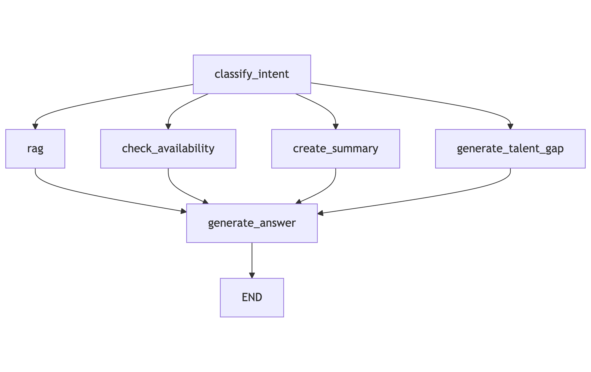

## POC - Resume Analyst prototype

This is a proof-of-concept for an AI-powered resume analysis and matching system.

### Features
- Semantic resume search using vector embeddings
- RAG-based answer generation
- Intent classification for HR queries
- Calendar integration for scheduling (mock data)
- Resume summary and Talent gap analysis

High Level Agent Architecture

[User Query]
     ↓
[Intent Classifier Node]
     ↓
 ┌─────────────┬──────────────┐──────────────┐
 │             │              │              |
[RAG Search] [Calendar] [Resume Summary]  [Talent gap analysis]
     ↓
[Context Aggregator]
     ↓
[Answer Generator]
     ↓
[Structured Output]

### Setup Instructions

docker compose build

docker compose exec api bash

alembic init alembic

docker compose exec db psql -U postgres -d resumedb

CREATE EXTENSION IF NOT EXISTS vector;

alembic revision --autogenerate -m "init schema"
alembic upgrade head

docker compose exec api python -m ingestion.ingest_initial_resumes

ADD metadate to pdfs
 exiftool -Title="Resume" -Author="SD" -employee_email="SD@company.com" -employee_id="SD" SD.pdf